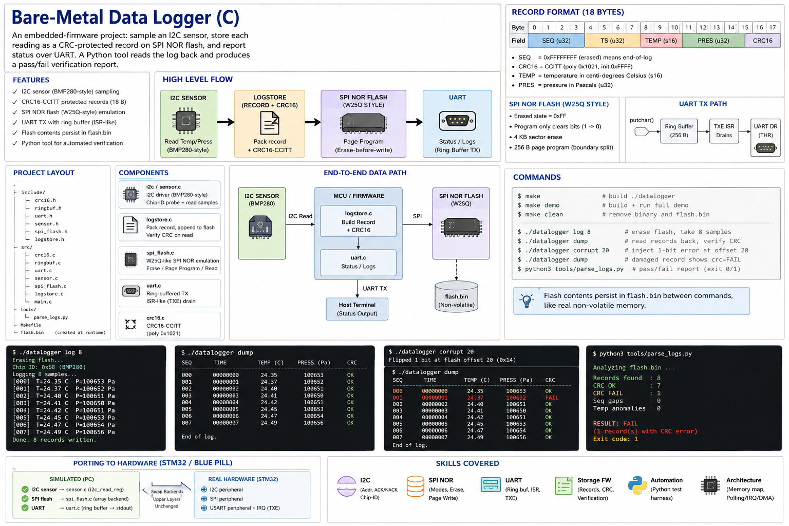
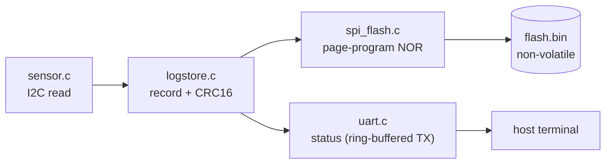
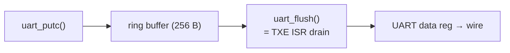

# Bare-Metal Data Logger (C)

An embedded-firmware project: sample an **I2C sensor**, store each reading as a
**CRC-protected record** on **SPI NOR flash**, and report status over **UART**.
A Python tool reads the log back and produces a **pass/fail verification report**.

The I2C sensor, SPI flash, and UART are simulated in C, so it runs on any PC
with **no hardware**. The drivers are written register-style, so they port to a
real STM32/Blue Pill by swapping the backends.



## Build & run

```sh
make          # build ./datalogger
make demo     # build + run the full end-to-end demo
make clean    # remove binary and flash.bin
```

```sh
./datalogger log 8        # erase flash, take 8 samples, store + print
./datalogger dump         # read records back, verify CRC
./datalogger corrupt 20   # inject a 1-bit media error at flash offset 20
./datalogger dump         # damaged record now shows crc=FAIL
python3 tools/parse_logs.py   # automated pass/fail report (exit 0/1)
```

Flash contents persist in `flash.bin` between commands, like non-volatile memory.

## Data path



## Record format (18 bytes)

| Offset | Field  | Type | Meaning                                   |
|-------:|--------|------|-------------------------------------------|
| 0      | `seq`  | u32  | sequence number (`0xFFFFFFFF` = end-of-log) |
| 4      | `ts`   | u32  | timestamp (ms)                            |
| 8      | `temp` | s32  | temperature, centi-°C (`2534` = 25.34 °C) |
| 12     | `pres` | u32  | pressure, pascals                         |
| 16     | `crc`  | u16  | CRC16-CCITT over bytes 0–15               |

## UART TX path



## Design notes

- **`spi_flash.c`** — W25Q-style NOR: erased = `0xFF`, program only clears bits
  (erase-before-write), 4 KB sector erase, 256 B page program with boundary
  splitting.
- **`logstore.c`** — packs each sample into an 18-byte `record_t` with a
  CRC16-CCITT; records are contiguous, an erased slot marks end-of-log.
- **`uart.c`** — ring-buffered TX drained by `uart_flush()`, modelling an
  interrupt-driven (TXE ISR) path.
- **`sensor.c`** — I2C driver (BMP280-style): confirms the device via a chip-ID
  register read, then returns samples.
- **`tools/parse_logs.py`** — runs `dump`, checks every CRC, flags temperature
  anomalies and sequence gaps, exits non-zero on failure.

## Layout

```
include/   driver headers (the API)
src/       crc16, ringbuf, uart, sensor, spi_flash, logstore, main
tools/     parse_logs.py
docs/      overview.png
```

## Skills covered

I2C (addressing, ACK/NACK, chip-ID probe) · SPI NOR (modes, erase-before-write,
sector/page granularity) · UART (ring buffer, ISR-driven TX) · storage firmware
(record format, CRC verification) · automation (Python test harness) ·
architecture (memory-mapped I/O, polling vs interrupt vs DMA).

## Porting to hardware

Replace the simulated backends with real peripheral registers: `sensor.c`'s
`i2c_read_reg` → the I2C peripheral, `spi_flash.c`'s array access → SPI
transactions, `uart.c`'s `putchar` → the USART data register. The upper layers
(`logstore`, CRC, records) stay unchanged.
